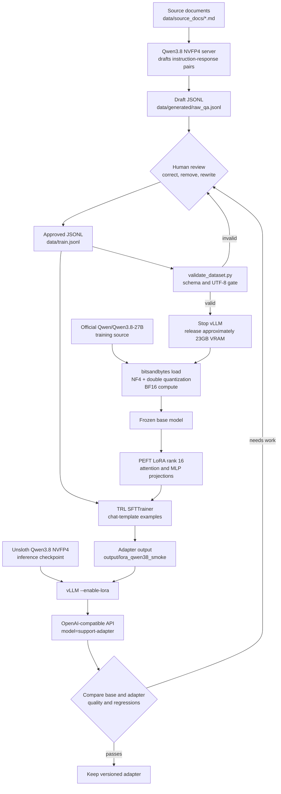

# Qwen3.8-27B QLoRA training guide

This guide describes the current repository workflow for training a new LoRA
adapter for Qwen3.8-27B on the 24GB RTX 5090 Laptop GPU.

## What is being trained

This system does **not** pretrain Qwen3.8 or update all 27 billion base-model
parameters. Full fine-tuning is beyond the memory capacity of this machine.

The supported approach is QLoRA:

1. download the official `Qwen/Qwen3.8-27B` training source;
2. load that source in temporary NF4 four-bit form with bitsandbytes;
3. freeze the base weights;
4. train small rank-16 LoRA matrices;
5. save only the adapter and tokenizer files;
6. attach the adapter to the separate NVFP4 serving checkpoint.

The existing Qwen3.6 adapters cannot be reused. The Qwen3.8 training and
adapter-serving path has not yet completed an end-to-end validation, so begin
with the smoke run below before spending time on a full dataset.

## Current system flow



The NF4 model exists only while training. It does not replace or modify the
NVFP4 checkpoint used by vLLM.

## Before starting

The official BF16 source is roughly 54GB before cache and runtime overhead.
Keep at least 65-80GB of disk space available for the source checkpoint and
temporary files, in addition to the existing 23.44GB NVFP4 checkpoint.

From WSL, enter the repository and activate its environment:

```bash
cd /mnt/c/Users/supre/Documents/QWEN-vLLM-LoRA
source .venv/bin/activate
```

Check disk, system RAM, and GPU memory:

```bash
df -h . ~/.cache/huggingface
free -h
nvidia-smi
```

## Ordered commands

### 1. Prepare source documents

Put reviewed `.md` or `.txt` files under `data/source_docs/`. Each file should
contain information the adapter should learn to answer or imitate.

```bash
ls -lh data/source_docs
```

### 2. Start the base server for draft generation

```bash
./scripts/start_server.sh
```

This serves `unsloth/Qwen3.8-27B-NVFP4`. Keep it running only while generating
draft examples. Use another WSL terminal for the next command.

### 3. Generate draft training examples

```bash
source .venv/bin/activate
python scripts/generate_training_data.py
```

The generator reads source documents, splits them into at most 2,000-character
chunks, requests three draft pairs per chunk at temperature `0.7`, and writes
`data/generated/raw_qa.jsonl`. It has no CLI flags and refuses to overwrite a
non-empty draft. Move an old draft aside before regenerating:

```bash
mv data/generated/raw_qa.jsonl data/generated/raw_qa.previous.jsonl
```

### 4. Review and promote only approved examples

Every non-blank JSONL line must have this form:

```json
{"instruction":"A user question","response":"The desired assistant answer"}
```

Remove invented facts, duplicates, weak answers, private information, and
examples whose style you do not want. Then promote the approved file:

```bash
cp data/generated/raw_qa.jsonl data/train.jsonl
```

Do not use this copy command until the draft has been reviewed.

### 5. Validate the dataset

```bash
python scripts/validate_dataset.py data/train.jsonl
```

The positional argument is the JSONL file to check. Validation verifies UTF-8,
JSON syntax, and non-empty `instruction` and `response` strings. Training also
runs this validation and stops if it fails.

### 6. Stop vLLM and release VRAM

If the server is in the foreground, press `Ctrl+C`. Otherwise run:

```bash
pkill -TERM -x vllm
nvidia-smi
```

Do not train until the vLLM allocation has been released. The training and
serving models cannot share this 24GB GPU.

### 7. Run the smallest Qwen3.8 smoke training

```bash
TRAIN_MODEL=Qwen/Qwen3.8-27B \
MAX_SEQ_LENGTH=512 \
BATCH_SIZE=1 \
NUM_EPOCHS=1 \
GRADIENT_ACCUMULATION_STEPS=8 \
GRADIENT_CHECKPOINTING=1 \
python scripts/train_lora.py \
  --data data/train.jsonl \
  --output output/lora_qwen38_smoke
```

The first run downloads the official training source. Successful completion
prints the final training loss and writes the adapter directory.

### 8. Inspect the adapter output

```bash
find output/lora_qwen38_smoke -maxdepth 1 -type f -printf '%f\n' | sort
```

Expect PEFT adapter configuration/weights and tokenizer files. The base model
remains in the Hugging Face cache.

### 9. Serve the new adapter

```bash
LORA_MODULES="support-adapter=output/lora_qwen38_smoke" \
  ./scripts/serve_with_lora.sh
```

`LORA_MODULES` uses `API_NAME=ADAPTER_PATH`. The launcher adds
`--enable-lora`, fixes maximum adapter rank at 16, and exposes this adapter as
the API model `support-adapter`.

### 10. Test and compare the adapter

```bash
source .venv/bin/activate
python scripts/test_client.py \
  --model support-adapter \
  --prompt "Ask a question represented in the reviewed training data."

python scripts/test_client.py \
  --model unsloth/Qwen3.8-27B-NVFP4 \
  --prompt "Ask the same question represented in the reviewed training data."
```

Compare factual correctness, style, unrelated general questions, and whether
the adapter overfits by repeating training responses unnecessarily.

### 11. Run a larger training only after the smoke test passes

```bash
pkill -TERM -x vllm
nvidia-smi

TRAIN_MODEL=Qwen/Qwen3.8-27B \
MAX_SEQ_LENGTH=1024 \
BATCH_SIZE=1 \
NUM_EPOCHS=3 \
GRADIENT_ACCUMULATION_STEPS=8 \
GRADIENT_CHECKPOINTING=1 \
python scripts/train_lora.py \
  --data data/train.jsonl \
  --output output/lora_qwen38_v1
```

Three epochs are an initial experiment, not a universal best value. Watch the
loss and evaluate held-out prompts. More epochs can worsen a small dataset
through memorization.

## Training flags and variables

Only two settings are CLI flags. The other controls are environment variables
placed before `python`.

| Setting | Type | Default | Meaning |
|---|---|---:|---|
| `--data PATH` | CLI flag | `data/train.jsonl` | Validated JSONL input. Overrides `TRAIN_DATA`. |
| `--output PATH` | CLI flag | `output/lora_adapter` | Adapter/tokenizer destination. Overrides `TRAIN_OUTPUT`. |
| `TRAIN_MODEL` | Environment | `Qwen/Qwen3.8-27B` from `model.env` | Official QLoRA base. Never use the NVFP4 serving checkpoint here. |
| `TRAIN_DATA` | Environment | `data/train.jsonl` | Alternative to `--data`. |
| `TRAIN_OUTPUT` | Environment | `output/lora_adapter` | Alternative to `--output`. |
| `MAX_SEQ_LENGTH` | Environment | `2048` | Maximum tokens per example. Lower saves activation memory but can truncate. Start at 512, then try 1024. |
| `BATCH_SIZE` | Environment | `2` | Examples per GPU step. Use `1` for 27B on 24GB. |
| `NUM_EPOCHS` | Environment | `3` | Dataset passes. Use `1` for a smoke test. |
| `GRADIENT_ACCUMULATION_STEPS` | Environment | `4` | Steps accumulated before an optimizer update. Batch 1 and value 8 give effective batch 8. |
| `GRADIENT_CHECKPOINTING` | Environment | `1` | Recomputes activations to save VRAM at a speed cost. Keep enabled here. |

These similarly named `model.env` values are **not read by the current
trainer**: `TRAIN_MAX_SEQ_LENGTH`, `TRAIN_BATCH_SIZE`, `TRAIN_NUM_EPOCHS`,
`TRAIN_GRAD_ACCUM`, `TRAIN_RESOURCE_FRACTION`, and
`TRAIN_GRADIENT_CHECKPOINTING`. Use the exact names in the table.

## Fixed choices in the current script

| Choice | Value | Purpose |
|---|---:|---|
| Base quantization | NF4 four-bit | Reduces frozen base-weight VRAM while training. |
| Double quantization | Enabled | Compresses quantization metadata further. |
| Compute dtype | BF16 | QLoRA computation format. |
| LoRA rank / alpha | 16 / 16 | Adapter capacity and scaling; serving also permits rank 16. |
| LoRA dropout | 0 | No dropout on adapter paths. |
| Learning rate | `2e-4` | SFT optimizer learning rate. |
| Target modules | `q/k/v/o`, `gate/up/down` projections | Adds adapters to attention and MLP projections. |
| Checkpoint saving | Disabled | Only the final adapter is saved; interrupted training cannot resume. |

## If training fails

- CUDA OOM: confirm vLLM is stopped; use sequence 512, batch 1, and gradient
  checkpointing 1.
- Disk full: free or relocate Hugging Face cache space without deleting the
  working NVFP4 snapshot accidentally.
- Dataset rejected: rerun the validator and fix every reported line.
- Model-class or bitsandbytes error: stop and save the complete traceback. The
  Qwen3.8 QLoRA path is not yet validated in this environment.
- Adapter load failure: verify it used the exact Qwen3.8 base architecture and
  has rank no greater than 16.

